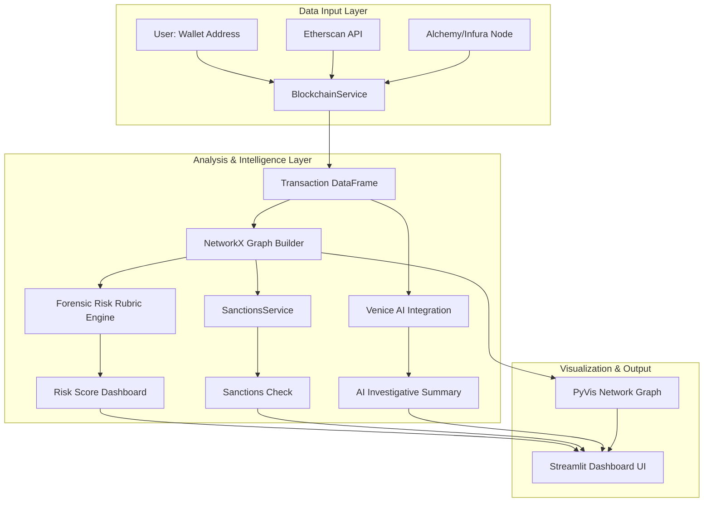

# 🔍 Blockchain Forensics Risk Analyzer Dashboard


**An enterprise-grade dashboard for cryptocurrency transaction analysis, forensic risk scoring, and AI-powered financial crime investigation.** This tool enables security analysts and investigators to trace blockchain transactions, assess risk using graph-based forensic algorithms, and generate intelligent investigative reports.

## ✨ **Features & Capabilities**

| Feature | Description | Use Case |
| :--- | :--- | :--- |
| **🔗 Transaction Tracer** | Fetches real transaction history via Etherscan API and visualizes fund flows as interactive graphs. | Trace wallet activity and identify transaction patterns. |
| **📊 Forensic Risk Rubric** | Computes quantitative risk scores using network centrality, clustering, proximity to known bad addresses, and transaction volume analysis. | Objectively score wallet risk for prioritization. |
| **⚠️ Sanctions Screening** | (Placeholder for Chainalysis API) Checks wallet addresses against sanctions lists and known illicit entities. | Compliance screening for AML/CFT regulations. |
| **🤖 AI Investigative Analyst** | Integrates with Venice AI to generate natural language analysis and SAR (Suspicious Activity Report) narrative drafts. | Automate report drafting and highlight key risks. |
| **📈 Interactive Visualization** | Renders transaction networks with PyVis for interactive exploration of connections. | Visually identify hubs, mixers, and complex layering. |

## 🏗 **System Architecture**



## 🚀 **Quick Start (For Evaluators & Recruiters)**

Want to see the dashboard in action without a full developer setup? Run it in just **3 minutes**:

```bash
# 1. Clone and enter the project
git clone https://github.com/yourusername/blockchain-forensics-dashboard.git
cd blockchain-forensics-dashboard

# 2. Set up a virtual environment (optional but recommended)
python -m venv .venv
source .venv/bin/activate  # On Windows: .venv\Scripts\activate

# 3. Install core dependencies
pip install streamlit web3 pandas requests

# 4. Run the dashboard with demo mode
streamlit run dashboard.py
```

The dashboard will open in your browser with sample data enabled.

## 💻 **Developer Setup with Visual Studio Code**

For full development, testing, and customization:

### **Prerequisites**
- **Python 3.9+** installed
- **VS Code** with these extensions:
  - `ms-python.python` (Python IntelliSense)
  - `ms-python.black-formatter` (Code formatting)
  - `njpwerner.autodocstring` (Documentation)
  - `rangav.vscode-thunder-client` (API testing)

### **Project Structure**
```
blockchain-forensics-dashboard/
├── dashboard.py              # Main application
├── requirements.txt          # Pinned dependencies
├── .env.example             # API key template
├── .gitignore
├── .vscode/                 # IDE configuration
│   ├── launch.json          # Debug configurations
│   └── settings.json        # Workspace settings
├── README.md
└── LICENSE
```

### **Complete Installation**
```bash
# Clone and setup
git clone https://github.com/yourusername/blockchain-forensics-dashboard.git
cd blockchain-forensics-dashboard

# Create and activate virtual environment
python -m venv .venv
source .venv/bin/activate  # Windows: .venv\Scripts\activate

# Install all dependencies with pinned versions
pip install -r requirements.txt

# Copy environment template and configure your API keys
cp .env.example .env
# Edit .env with your actual API keys
```

### **VS Code Configuration**
The project includes optimized VS Code settings:

**.vscode/settings.json:**
```json
{
    "python.defaultInterpreterPath": "${workspaceFolder}/.venv/bin/python",
    "python.terminal.activateEnvironment": true,
    "editor.formatOnSave": true,
    "python.formatting.provider": "black",
    "[python]": {
        "editor.defaultFormatter": "ms-python.black-formatter"
    }
}
```

**.vscode/launch.json (for debugging):**
```json
{
    "version": "0.2.0",
    "configurations": [
        {
            "name": "Run Forensic Dashboard",
            "type": "python",
            "request": "launch",
            "module": "streamlit",
            "args": ["run", "dashboard.py"],
            "console": "integratedTerminal"
        }
    ]
}
```

### **Running the Application**
- **Quick Run:** `streamlit run dashboard.py`
- **Debug Mode:** Press `F5` in VS Code with the "Run Forensic Dashboard" configuration
- **CLI with Options:** `streamlit run dashboard.py --server.port 8501 --server.address 0.0.0.0`

## 🧠 **AI Models & Forensic Algorithms**

### **Venice AI Integration**
The dashboard integrates **Venice AI's Dolphin-72B model** for intelligent analysis:
- **Purpose:** Generates investigative summaries and SAR narrative drafts
- **Input:** Transaction data + forensic risk scores
- **Output:** Natural language analysis highlighting red flags and patterns
- **Configuration:** Set `VENICE_API_KEY` in your `.env` file

```python
# Example AI analysis prompt
prompt = f"Analyze for financial crimes: {transactions_df.to_json()}. Risk: {risk_data}"
```

### **Forensic Risk Scoring Algorithm**
The `forensic_rubric()` function implements four quantitative risk metrics:

1. **Centrality Risk (0-100):** `degree_centrality × 1000`
   - High degree = potential mixing service or hub
   
2. **Bad Proximity Risk (0-100):** `100 / (average_path_length + 1)`
   - Shorter paths to known bad addresses = higher risk
   
3. **Volume Risk (0-100):** Complex scaling of mean, std dev, and max values
   - Identifies unusually large or erratic transaction patterns
   
4. **Clustering Risk (0-100):** `average_clustering × 100`
   - High clustering = potential coordinated laundering networks

**Overall Risk Score:** Weighted average of all four metrics

## 📋 **API Key Requirements**

| Service | Purpose | Required | Free Tier |
| :--- | :--- | :--- | :--- |
| **Etherscan** | Transaction history retrieval | ✅ Required | 5 calls/sec |
| **Alchemy/Infura** | Blockchain node access (fallback) | ✅ Required | Generous limits |
| **Venice AI** | AI-powered analysis generation | ✅ Required | Limited free credits |
| **Chainalysis** | Sanctions screening (placeholder) | ⚠️ Optional | Paid service |

**`.env` Configuration:**
```bash
# Blockchain APIs
ETHERSCAN_API_KEY=your_etherscan_key_here
ALCHEMY_API_URL=https://eth-mainnet.g.alchemy.com/v2/YOUR_KEY
INFURA_API_URL=https://mainnet.infura.io/v3/YOUR_KEY

# AI Services
VENICE_API_KEY=your_venice_ai_key

# Advanced Features (Placeholder)
CHAINALYSIS_API_KEY=your_chainalysis_key
```

## 🐳 **Docker Deployment (Optional)**

```dockerfile
FROM python:3.9-slim
WORKDIR /app
COPY requirements.txt .
RUN pip install --no-cache-dir -r requirements.txt
COPY . .
EXPOSE 8501
CMD ["streamlit", "run", "dashboard.py", "--server.port=8501", "--server.address=0.0.0.0"]
```

Build and run:
```bash
docker build -t forensics-dashboard .
docker run -p 8501:8501 --env-file .env forensics-dashboard
```

## 📄 **Dependencies**

<details>
<summary><strong>View Full Requirements</strong></summary>

```txt
# Core Framework
streamlit==1.42.0           # Dashboard interface
web3==7.14.0                # Blockchain interaction
requests==2.32.3            # API communications

# Data Analysis & Visualization
pandas==2.2.3               # Data manipulation
numpy==1.26.4               # Numerical computations
networkx==3.4.2             # Graph analysis algorithms
pyvis==0.3.2                # Interactive network visualization

# External APIs & Utilities
pycoingecko==3.2.0          # Cryptocurrency market data
python-dotenv==1.0.1        # Environment configuration
```

</details>

Install all dependencies:
```bash
pip install -r requirements.txt
```

## 🚨 **Troubleshooting**

| Issue | Solution |
| :--- | :--- |
| **"No transactions found"** | Verify Etherscan API key in `.env`; check rate limits |
| **AI analysis fails** | Confirm Venice AI API key and account credits |
| **Graph visualization empty** | Ensure PyVis installed correctly; check browser console |
| **Node connection errors** | Test Alchemy/Infura URLs directly; use fallback mechanism |

## 📈 **Roadmap & Future Enhancements**

- [ ] **Multi-chain support** (Polygon, BSC, Arbitrum)
- [ ] **Integration with commercial forensics tools** (Chainalysis Reactor, Elliptic)
- [ ] **Advanced ML models** for pattern recognition
- [ ] **Batch processing** for multiple addresses
- [ ] **PDF report generation** with professional templates
- [ ] **Database backend** for case management

## 📜 **License**

This project is licensed under the MIT License - see the [LICENSE](LICENSE) file for details.

## 👨‍💻 **Author & Contact**

**Ernest Kofi Antwi**  
*Senior Software Engineer | AI & Blockchain Security Specialist*

- **Portfolio:** [GitHub Profile][(https://github.com/QuantumXPower111/Blockchain_Forensics_Risk_Analyzer/edit/main/README.md)]
- **Email:** ErnestK.Antwi2013@zoho.com]
---

> *"This tool represents the convergence of blockchain technology, data science, and artificial intelligence to combat financial crime. Built for investigators by an investigator."*
